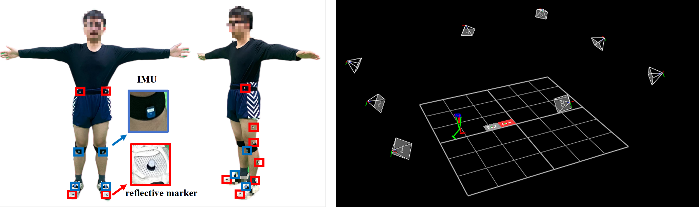

# MeaKAM
✨✨✨This is the official implementation of A Novel Multi-Graph-Structure Guided Human Lower-Limb Physiological Load Estimation Method  Based on Multi-Inertial-Sensors Fusion During Walking.

<h1>A Novel Multi-Graph-Structure Guided Human Lower-Limb Physiological Load Estimation Method  Based on Multi-Inertial-Sensors Fusion During Walking.</h1>

  <strong>Zehui Feng, Tong Wu, Dian Zhu, Susana Liu, Hongtao Zheng, Huiwu Li, Ting Han*</strong> 
  <em>
    a School of Design, Shanghai Jiao Tong University, Shanghai 200240, China 
    b Innovation Center of Yangtze River Delta, Zhejiang University, Jiaxing 314100, China 
    c Institute of Medical Robotics, Shanghai Jiao Tong University, Shanghai 200240, China 
    d Shanghai Ninth People's Hospital, School of Medicine, Shanghai Jiao Tong University, Shanghai 201306, China
  </em>

# Abstract
💻💻💻Wearable technology has advanced sensor-based human physiological information measurement, offering broad application prospects in health monitoring. Knee Adduction Moment (KAM) is always used as a measurement of lower-limb physiological load. Traditional musculoskeletal calculation methods  rely on collecting joint kinematics data from pressure tables and optical motion capture system. In contrast, wearable-based deep-learning methods for KAM estimation offer a more cost-effective solution. However, they still face challenges in achieving high measurement accuracy and stability. In this work, we focus on developing and validating a robust estimator for a key biomechanical marker (KAM) that can serve as a basis for downstream translational studies. We propose a deep-learning KAM measurement method (MeaKAM) based on multi-inertial-sensors fusion, which consists of four core modules. The Multi-Granularity Encoder (MGE) module captures multi-granularity temporal features. The Gait-Guided Graph Learning (GGL) Module constructs three graph structures to explicitly model the dependencies between sensors, orientations, and time steps. Finally, we introduce the Dual-Granularity Denoising Enhancement (DDE) module to improve step-wise diffusion refinement. Meanwhile, three multi-task learning strategies are used to enhance the generalization performance of MeaKAM. Extensive experiments on several real datasets show that our framework MeaKAM achieves state-of-the-art compared with counterpart estimation methods. MeaKAM achieved 0.29% BW×BH and 1.47% BW×BH in mean-square-error (MSE) with Dataset IMU-Phone and IMU-KAM, obtaining a 5.44% improvement over the SOTA, and achieving 1.95×10-4 in Squared Deviation jitter with Dataset IMU-KAM, obtaining a 39.76% improvement over the SOTA. Extensive Experiments including ablation, explainability,  calculation cost, additional lower limb indicator experiment, and configuration experiments demonstrate the wide applications of MeaKAM in lower limb motion analysis scenarios.

# Environment Layout Setup

# Comparison Results

# Ablation Results

# Data
🚀🚀🚀 We are currently in the process of requesting permission to publicly release the full dataset. In the meantime, we have provided three sample subjects to illustrate the data construction and format. If you need additional examples, please contact fzh_sjtu@sjtu.edu.cn, and we can provide sample data from six subjects.

# Contact
📩📩📩 For questions or suggestions, please contact [**Zehui Feng**](fzh_sjtu@sjtu.edu.cn).
